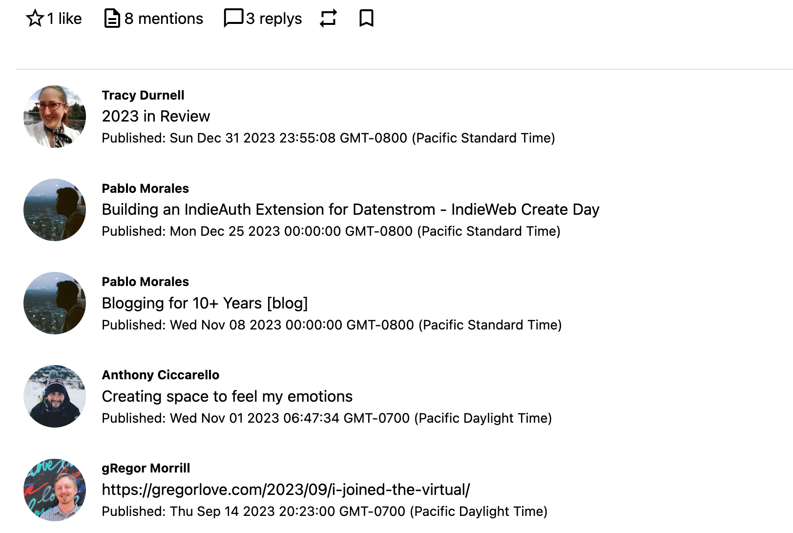

# yellow-webmention

More changes to come!

## How to install an extension

[Download ZIP file](https://github.com/pmoralesgarcia/yellow-webmention/archive/refs/heads/main.zip) and copy it into your `system/extensions` folder. [Learn more about extensions](https://github.com/annaesvensson/yellow-update).

## How to show webmentions

The extension adds a webmention section on blog pages.

To add webmentions on other pages create a `[webmention]` shortcut. The following optional argument is available:

To put webmentions on every page of the site, add `<?php echo $this->yellow->page->getExtraHtml("webmention") ?>` in  `system/layouts/default.html`, after the line `<?php echo $this->yellow->page->getContentHtml() ?>`.

## Examples

Content file with webmentions:

    ---
    Title: Example page
    ---
    Lorem ipsum dolor sit amet, consectetur adipisicing elit, sed do eiusmod tempor incididunt ut 
    labore et dolore magna pizza. Ut enim ad minim veniam, quis nostrud exercitation ullamco laboris 
    nisi ut aliquip ex ea commodo consequat. Duis aute irure dolor in reprehenderit in voluptate velit 
    esse cillum dolore eu fugiat nulla pariatur. Excepteur sint occaecat cupidatat non proident, sunt 
    in culpa qui officia deserunt mollit anim id est laborum.
    
    [webmention]

Layout file with webmentions:

    <?php $this->yellow->layout("header") ?>
    

    

    <h1><?php echo $this->yellow->page->getHtml("titleContent") ?></h1>
    <?php echo $this->yellow->page->getContentHtml() ?>
    <?php echo $this->yellow->page->getExtraHtml("webmention") ?>
    

    

    <?php $this->yellow->layout("footer") ?>

## Settings

The following settings can be configured in file `system/extensions/yellow-system.ini`:

Coming Soon! 

## Acknowledgements

This extension was created by following examples in the Datenstrom [API for Developers] Guide. Thank you fo the great work!

This guide was based on GiovanniSalmeri's [yellow-comments] documentation. Thank you for the great work!
## Developer

Pablo Morales. [Get help](https://datenstrom.se/yellow/help/).

